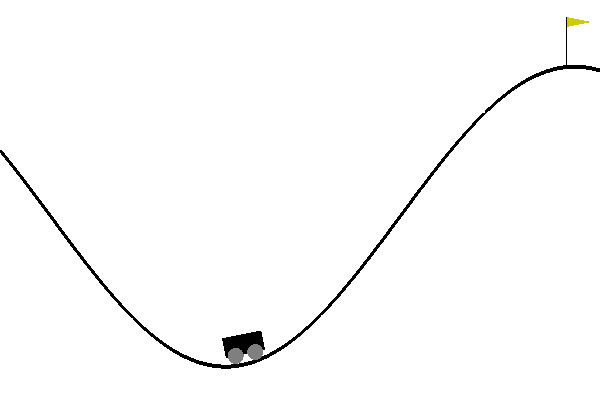

# RL-Experiment
Reproduce simple experiment with gym for RL algorithm. All these algorithms are based on the Bellman Equation where : 
-  is the state-value function of MDP (Markov Decision Process). It's the expected return starting from state s following policy $\pi$. 
- $Q^\pi(s)$ is the action-value function. It is the expected return starting from state s, following policy $\pi$, taking action $a$

The Bellman Equations are : 

$V_{\pi}(s)=\sum_{a \in \mathcal{A}} \pi(a \mid s)\left(R_{s}^{a}+\sum_{s^{\prime} \in S} \gamma \mathcal{P}_{s s^{\prime}}^{a} V_{\pi}\left(s^{\prime}\right)\right)$ with $R$ the reward, $\gamma$ the discount, $P$ the transition matrix probability, $V$ the value function, $s$ the state, $a$ the action and $\pi$ the probability of making the decision in state $s$ (policy).

$q_{\pi}(s, a)=R_{s}^{a}+\sum_{s^{\prime} \in \mathcal{S}} \gamma \mathcal{P}_{s s^{\prime}}^{a} \underset{a \in \mathcal{A}}{\pi\left(a \mid s^{\prime}\right)} q_{\pi}\left(s^{\prime}, a\right)$ with $a$ the action, and $P$  the probability that action $a$ in state $s$ time t will lead to state $s′$ at time $t + 1$

0 - Value Iteration and policy iteration : [0-ValueIteration-PolicyIteration](0-ValueIteration-PolicyIteration.ipynb)

1- Monte Carlo : [1-Model-free-MonteCarlo](1-Model-free-MonteCarlo.ipynb)

